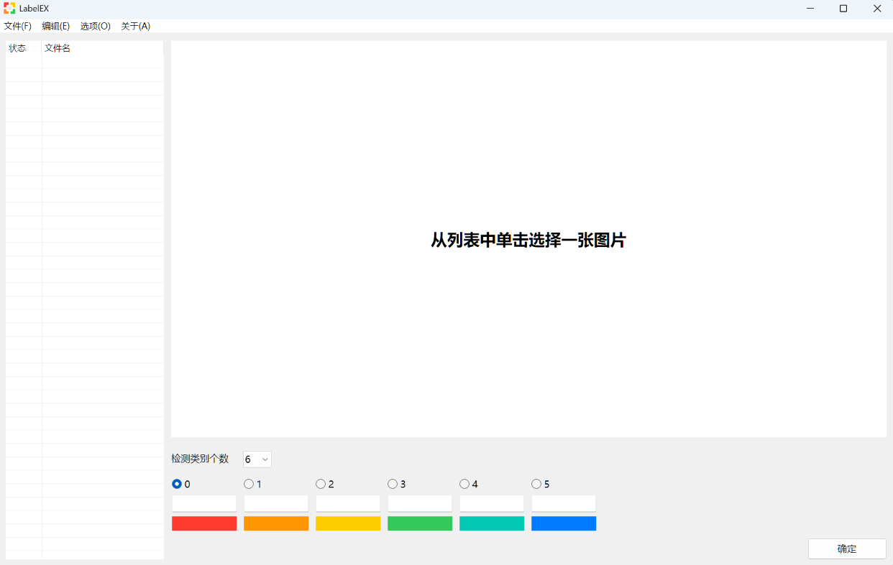
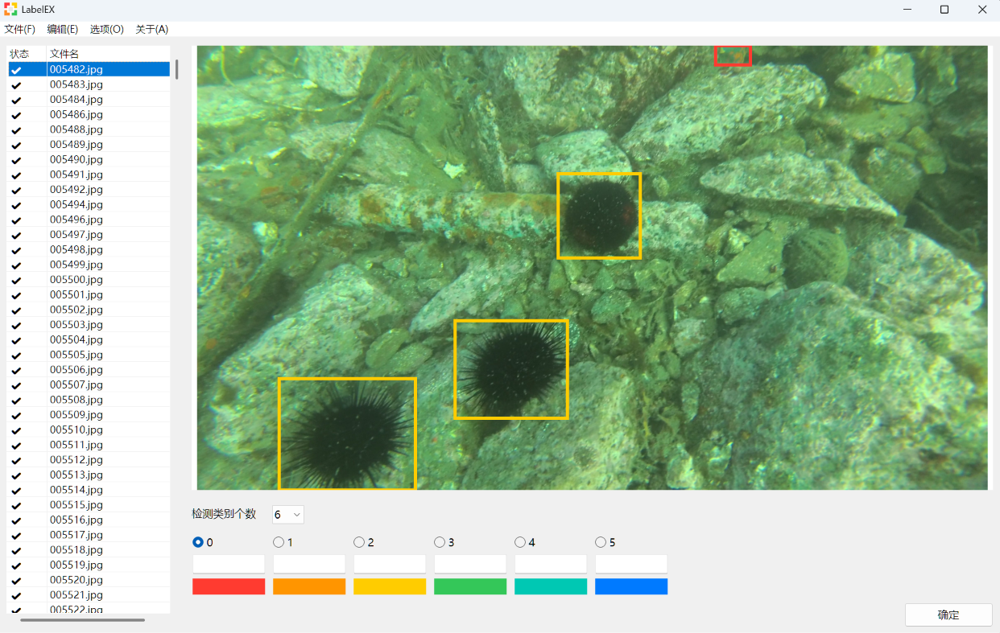

# LabelEX - For EASY model labeling!
There are many model labeling tools available today, but they either fail completely after changing environments, or are painfully difficult to use and plagued by frequent crashes.  
It's time to switch to **LabelEX** – a labeling tool written entirely with the Win32 API.
## Quick start guide
Simplified Chinese:  
打开`LabelEX.exe`，界面如下所示 

<p align="center">
  
</p>

左上角单击文件菜单，单击打开文件夹，在其中选择你的图片集所在的文件夹（子文件夹将会被忽略！）  
打开后，界面如下所示  

<p align="center">
  
</p>

光标移动到图片部分即可开始编辑，在此你可以：  
- 在下方选择类别标签的个数，然后选择类别标签，或者按下`0`-`9`选择  
- 在下方添加对类别的定义，这一标注不会保存到标注文件中  
- 在上方绘制矩形框，注意使得矩形框内侧紧贴需要标注的物体边缘，矩形框本身并不计入  
- 单击矩形框可选中对应的矩形，此时出现编辑手柄  
- 按住矩形框即可拖动矩形框，按住编辑手柄即可编辑矩形框大小  
- 如绘制出现问题，在选中矩形框后按下`delete`，即可删除不需要的矩形框

绘制完毕后，单击右下角的“确定”，会自动生成此图片的标签文件，并切换到下一张图片  
标签文件将生成在当前目录，当当前目录下存在有效的标签文件时，列表状态将变为“√”，此时单击列表的文件可以预览标注结果  
## System requirement
- Operating System: Windows 10/11 (build 17763 and above)  
- Architecture: x86/64  
- Runtime: Using Win32 API, GDI+ and Common Controls (already included in your system, no extra runtime needed)  
- Compiler Environment: Visual Studio 2017+, CMake 3.8+  
## Project structure
```text
LabelEX
├── doc/
│   ├── ARCHITECTURE.md # Simple explanation of architecture
│   ├── API_DOCUMENTATION.md # API Documentation
│   └── USER_MANUAL # detailed User Manual
├── src/
│   ├── main.cpp/h # main/program entrance
│   ├── PageAbout.cpp # about and license page
│   ├── PagePicture.cpp # picture editing page
│	└── resource.h # resource ID
├── res/
│   ├── LabelEX.rc # resource files
│	└── manifest.xml # enable Common Controls 6.0
├── CMakeLists.txt # CMake configurations
└── README.md # readme
```
